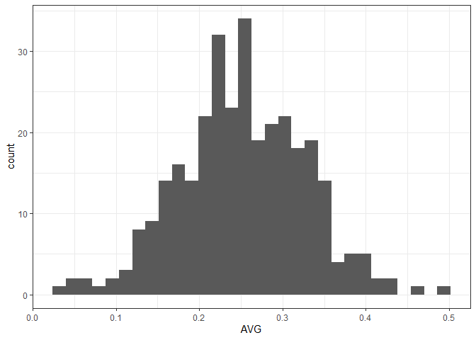

FanGraphs Functions Pt.3: Data Exploration
================

We will look at specific baseball statistics and the correlations among
them.

### Aggregated data

Aggregated/summarized data is great for visualization. We can start at
the “macroscopic” level of the league and teams. We use the `ggplot2`
package for plotting because this tends to be the easiest way when
dealing with grouping. The default theme is questionable, so add
`theme_bw` to the `theme_set` function

``` r
suppressMessages(library(dplyr))
library(ggplot2)
theme_set(theme_bw())

source('Finished_Functions.R')

url <- fg_url(Stats = 'bat', Type = 8, 
              Qual = '20', # arbitrary; a little under half of avg PA
              Month = 1000, 
              Max.results = 1000,
              Start.date = '2019-06-01',
              End.date = '2019-06-14')

df <- fg_table(url)
```

We start by looking at a histogram of the data to see the frequencies of
batting averages, along with a formal test for normality.

``` r
ggplot(df) + 
  geom_histogram(aes(AVG))
```

    ## `stat_bin()` using `bins = 30`. Pick better value with `binwidth`.

<!-- -->

``` r
shapiro.test(df$AVG)
```

    ## 
    ##  Shapiro-Wilk normality test
    ## 
    ## data:  df$AVG
    ## W = 0.99707, p-value = 0.8417

The data looks like it is normally-distributed across the league. This
is backed by the Shapiro-Wilk test of normality (any p-value above 0.05
is typically considered normal).

There’s a pretty big drop in the number of players around an individual
average around 0.350. We will consider this the “exceptional” range
relative to the rest of the league.

``` r
df.top <- df %>%
  filter(AVG > .350)

nrow(df.top) 
```

    ## [1] 26

We can add text to the scatterplot to visualize how well the players are
performing in these categories relative to each other. A lower number of
plate appearances leaves less chances for a bad game or 2 (.000 batting
avg.) to deflate your batting average. So we also want to consider the
number of PA’s a player had in this span of time. To do this on our
graph, we add a transparency gradient.

``` r
library(ggrepel)

ggplot(df.top) +
  geom_point(aes(x = SLG, y = AVG)) +
  geom_text_repel(aes(x = SLG, y = AVG, 
                   label = Name, alpha = PA)) +
  theme(
    panel.grid.minor = element_blank() # for cleaner look
    )
```

<!-- -->

The graph is a little cluttered, but it displays the information we
want: finding the top players in terms of both power and batting
averages.

Fun fact: we are looking at the ISO statistic in the above graph. ISO
stands for “isolated power” and is usually calculated as SLG - AVG.

### 2\. Team performance

##### Q1: top 5 AVG/SLG

We also want to look at performance of each team. What 5 teams have the
best batting average for the first 2 weeks of June?

``` r
df.team <- df %>%
  group_by(Team) %>%
  summarize(Mn.AVG = mean(AVG),
            Mn.SLG = mean(SLG),
            Sd.AVG = sd(AVG),
            Sd.SLG = sd(SLG)) %>%
  arrange(desc(Mn.AVG))

head(df.team, 5)
```

    ## # A tibble: 5 x 5
    ##   Team    Mn.AVG Mn.SLG Sd.AVG Sd.SLG
    ##   <chr>    <dbl>  <dbl>  <dbl>  <dbl>
    ## 1 Pirates  0.301  0.489 0.0647 0.108 
    ## 2 Twins    0.290  0.557 0.0705 0.131 
    ## 3 Rockies  0.286  0.458 0.105  0.277 
    ## 4 Red Sox  0.286  0.499 0.0775 0.142 
    ## 5 Marlins  0.275  0.417 0.0593 0.0969

##### Q2: distribution of averages

One way to look at how well teams are performing is to look how they’re
doing relative to the rest of the league. There are metrics out there
(e.g. WRC+) that account for this, but we will do this manually to look
at average alone.

There’s a handful of options we can use to contrast players that are
performing well vs. poorly: mean-centering, z-scores, percentiles, etc.
Both mean-centering and percentiles are guaranteed to give us a handful
of data points after performance distinction. However, mean-centering is
not very helpful to find players below or above a cutoff, and with
z-scores, it’s possible that we won’t even find an outlier (typically z
\> 1.96).

Taking these into account, we choose to separate the data using
percentiles.

``` r
p <- ggplot(df.team) + 
  geom_histogram(aes(Mn.AVG),
                 color = 'black', bins = 60,
                 position = position_dodge()) +
  theme(panel.grid.minor = element_blank(),
        panel.grid.major.x = element_blank()) +
  labs(x = 'Team Batting Average',
       y = 'Count')

### make df of 25, 50, 75th percentiles for plotting
vec.nms <- c('twen5th', 'med', 'sev5th') 
perc.vals <- as.vector(summary(df.team$Mn.AVG)[c(2, 3, 5)])
names(perc.vals) <- vec.nms

df.perc <- as.data.frame(t(perc.vals))

### graph with percentiles
p + geom_vline(data = df.perc,
               aes(xintercept = twen5th),
               linetype = 'dashed',
               color = 'red') +
  geom_vline(data = df.perc,
               aes(xintercept = sev5th),
               linetype = 'dashed',
             color = 'red')
```

<!-- -->
<BR> The teams that we want to look at are below the 25th percentile and
above the 75th percentile. This will help us arbitrarily label and
contrast “good” vs. “bad” team performance. So now we code these teams
in tiers accordingly: lower, middle (between these limits), upper.

``` r
df.team$Tier <- ifelse(df.team$Mn.AVG < df.perc$twen5th, 'Lower',
                           ifelse(df.team$Mn.AVG > df.perc$sev5th,
                                  'Upper', 'Middle'))
```

##### Q3:

On first thought, one might use a boxplot by team to look at how batting
averages are dispersed within teams.

``` r
ggplot(df) +
  geom_boxplot(aes(x = Team, y = AVG)) +
  geom_point(aes(x = Team, y = AVG))
```

<!-- -->

On second thought, it’s really hard to objectively describe the
dispersion of data points using just a boxplot.

Let’s say that we expect the typical distance from the team average to
be lower on teams that are on a “hot streak”. We can look at the
standard deviations from the team means to measure this. In theory, this
may occur because the opposing teams don’t want to waste good closing
pitchers after being down a lot of runs, or it could be from some sort
of psychological effect.

So now we look at the standard deviations for each team and label
according to tier.

``` r
### order bars in descending order
df.team$Team <- factor(df.team$Team, 
                       levels = df.team$Team[order(-df.team$Sd.AVG)])

ggplot(df.team %>% arrange(desc(Tier))) +
  geom_bar(aes(x = Team, y = Sd.AVG, fill = Tier), 
           stat = 'identity') +
  scale_x_discrete()
```

<!-- -->

This graph suggests that team performance probably isn’t affected by the
performance of the rest of the team. However, we can measure this
empirically using a hierarchical mixed effects model.
